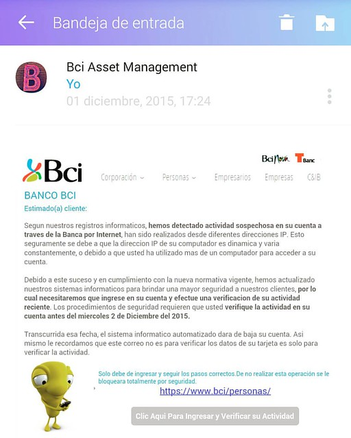
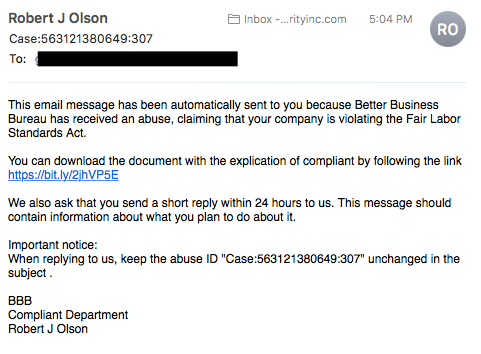

# INFORME DE ATAQUE PISHING

NOMBRE: MATIAS ESPINOZA VELIZ

CARGO: DESARROLLADOR WEB

FECHA: 09/08/2024

 
## Resumen Ejecutivo

La mañana de este viernes del mes de agosto a las 08:30 am, debo informar que nuestra empresa ha sido víctima de un ataque de phishing, un método comúnmente utilizado para robar información confidencial como contraseñas y datos bancarios. Este incidente ha tenido un impacto significativo en la empresa, dañando tanto nuestra reputación como la confianza de nuestros clientes debido al compromiso de información valiosa.
A continuación, se presenta un análisis detallado del caso, acompañado de material gráfico para ayudar a reconocer este tipo de ataques en el futuro.

## Introducción

El ataque de phishing mencionado fue dirigido a un trabajador del sector de Finanzas de nuestra empresa. El atacante se hizo pasar por un cliente interesado en obtener cotizaciones de nuestros planes, enviando un archivo adjunto malicioso por correo electrónico que, al ser descargado, permitió al ciberdelincuente tener control visual de las contraseñas y pagos de manera remota.

## Antecedentes del Caso

El ciber atacante llevó a cabo un estudio previo, aprovechando que el ataque coincidió con fechas clave de pago a proveedores y sueldos de trabajadores, lo que resultó en daños financieros significativos para la empresa. El ataque fue detectado cuando, al intentar acceder a la banca en línea, se activó una alerta de autenticación de dos pasos que requería una contraseña adicional, lo cual levantó sospechas y llevó al descubrimiento del ataque.

## Objetivos del Análisis

El análisis tiene como objetivo identificar los vectores de ataque, determinar el alcance del compromiso, y proponer mejoras en la seguridad para evitar futuros incidentes similares.
Metodología

La metodología de este informe incluye la recolección de datos mediante la captura de tráfico de red, análisis forense de sistemas comprometidos y revisión de registros de eventos. Las fases del análisis comprenden la identificación de la causa raíz del ataque, la evaluación del impacto, y la elaboración de recomendaciones de seguridad.

## Herramientas Utilizadas

•	Wireshark: Para la captura y análisis de paquetes de red.

•	VirusTotal: Para el análisis de archivos sospechosos.

•	Autopsy: Para análisis forense de sistemas.

## Procedimientos de Adquisición

La evidencia digital fue recolectada mediante la captura de paquetes de red, extracción de registros de eventos de los servidores comprometidos y análisis forense de los dispositivos afectados.

## Técnicas de Análisis

Las técnicas utilizadas incluyeron el análisis de registros del sistema, ingeniería inversa del malware detectado, y análisis del tráfico de red para identificar conexiones no autorizadas y potenciales canales de exfiltración de datos.

## Hallazgos

Se identificaron varias vulnerabilidades explotadas por el atacante, incluyendo la falta de concienciación en el personal sobre amenazas de phishing y la ausencia de medidas de seguridad adicionales en la autenticación de correo electrónico.

## Evidencia Digital

 

## Análisis de la Red

El análisis del tráfico de red reveló múltiples intentos de conexión a servidores externos no autorizados, así como la transferencia de datos sensibles fuera de la red corporativa, indicando un posible canal de exfiltración utilizado por el atacante.

## Análisis de Sistemas

Se observó la instalación de software malicioso en los sistemas comprometidos, incluyendo un keylogger que permitió al atacante capturar credenciales de acceso y monitorear la actividad del usuario en tiempo real.

## Análisis e Interpretación de los Hallazgos

El análisis sugiere que el atacante explotó la falta de seguridad en la autenticación de correo electrónico y aprovechó el desconocimiento del empleado sobre las técnicas de phishing. La ingeniería social fue clave en la ejecución del ataque, lo que resalta la necesidad de mejorar la formación en seguridad para el personal.

## Línea de Tiempo de los Eventos

1.	08:00 am: Recepción del correo electrónico malicioso.
2.	08:05 am: El archivo adjunto es descargado y ejecutado.
3.	08:10 am: El atacante obtiene acceso remoto al sistema comprometido.
4.	08:15 am: El atacante inicia la exfiltración de datos.
5.	08:20 am: Activación de la alerta de autenticación en el banco.
6.	08:30 am: Se descubre el ataque y se inicia la respuesta.

## Posibles Vectores de Ataque

El vector de ataque principal fue el correo electrónico de phishing, que engañó al empleado para descargar un archivo malicioso. Otros posibles vectores incluyen la explotación de vulnerabilidades en los sistemas de autenticación de correo y la falta de medidas de seguridad avanzadas como la autenticación multifactor.

## Conclusiones

El ataque de phishing tuvo un impacto significativo en la seguridad y las finanzas de la empresa. La falta de concienciación en el personal y la ausencia de medidas de seguridad robustas permitieron al atacante comprometer información crítica y dañar la reputación de la empresa.

## Resumen de los Hallazgos Clave

•	Vulnerabilidad en la autenticación de correo electrónico.
•	Uso de ingeniería social para engañar al personal.
•	Falta de formación en seguridad cibernética entre los empleados.

## Respuestas a las Preguntas Iniciales

1.	¿Cómo se ejecutó el ataque?: Mediante un correo electrónico de phishing que contenía un archivo adjunto malicioso.

2.	¿Qué información fue comprometida?: Credenciales de acceso y datos financieros de la empresa.

3.	¿Cómo se detectó el ataque?: A través de una alerta de autenticación de dos pasos en la banca en línea.

## Recomendaciones

Para prevenir futuros ataques, se recomienda implementar autenticación multifactor para todos los accesos críticos, mejorar la formación en seguridad cibernética para los empleados, y realizar auditorías periódicas de seguridad.
Acciones a Corto Plazo

•	Implementar autenticación multifactor en todos los sistemas.

•	Revocar las credenciales comprometidas y realizar un cambio de contraseñas.

•	Realizar un análisis exhaustivo de todos los sistemas para asegurar la eliminación completa del malware.

## Acciones a Largo Plazo

•	Desarrollar un programa continuo de formación en seguridad para el personal.

•	Implementar soluciones avanzadas de seguridad como detección de intrusiones y monitoreo constante de la red.

•	Revisar y actualizar las políticas de seguridad interna.

## Mejoras en los Procesos de Seguridad

Se propone la adopción de mejores prácticas de seguridad, como la segmentación de la red, el monitoreo continuo de actividades sospechosas, y la implementación de políticas estrictas de gestión de contraseñas.

## Anexos

•	Capturas de Pantalla: Imágenes de las principales etapas del análisis y del ataque.
